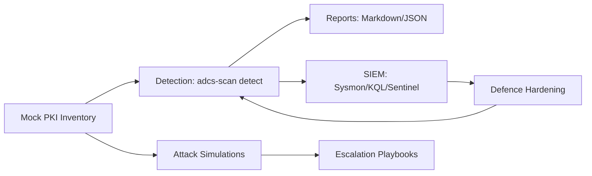

# Active Directory Certificate Services (ADCS) Attack & Defence Lab

A production-grade, end-to-end lab that simulates exploitation and mitigation of
ADCS ESC1–ESC8 attack paths. The project blends detection (Python/KQL), attack
playbooks (Python/PowerShell), and defence assets (hardening scripts, Sysmon,
Sentinel) into a single toolkit for red and blue teams.



## Why ADCS Matters
ADCS issues certificates used for Kerberos, smartcard logon, VPN, and TLS. Weak
PKI design lets adversaries mint trusted credentials, impersonate administrators,
and bypass MFA using certificate-based Kerberos tickets.

## Repository Structure
- `adcs_scan.py` — CLI wrapper for detection/exploitation/defence guidance.
- `adcs_lab/attacks/` — ESC1/2/3/4/8 simulations mirroring Certipy/Certify logic.
- `adcs_lab/detection/` — Mock PKI inventory, misconfiguration scanner, KQL
  queries, and BloodHound ingestor config.
- `adcs_lab/defence/` — Hardening scripts, Sysmon rules, and Sentinel workbook.
- `adcs_lab/docs/` — Architecture overview, ESC reference, API, and usage guide.
- `tests/` — Pytest coverage for scanner logic and CLI flows.
- `.devcontainer/` — VS Code Remote Container settings.
- `requirements-dev.txt` — Tooling dependencies for local development.

## Quickstart
```bash
python adcs_scan.py detect --output report.md
python adcs_scan.py exploit --technique esc1 --user attacker
python adcs_scan.py exploit --technique esc8 --host relay-host
python adcs_scan.py defend
```

## Example Detection Output
Running `python adcs_scan.py detect` produces Markdown/JSON summarizing
vulnerable templates (ESC1/2/3/4/6/7/8) and CA ACL risks (ESC5) from the mock
inventory. Reports can be ingested into dashboards or shared with leadership.

## Attack Simulations
- **ESC1**: Open enrollment template -> attacker PFX -> PKINIT TGT.
- **ESC2**: Enrollment agent abuses `ENROLLEE_SUPPLIES_SUBJECT` to mint a cert on
  behalf of another user.
- **ESC3/ESC4**: Dangerous EKUs or AnyPurpose templates enable service
  impersonation and delegation.
- **ESC8**: NTLM relay to HTTP enrollment endpoints without EPA.

## Defence & Monitoring
- PowerShell scripts under `defence/hardening` lock down EKUs, enrollment
  permissions, and audit CA ACLs.
- `defence/sysmon_rules/adcs_sysmon.xml` covers certreq/certipy and enrollment
  network events.
- `defence/sentinel/workbook.json` and `detection/kql_queries` provide Azure
  Sentinel hunting content.

## Setup & Tooling
- Python 3.10+ recommended.
- Install dev tools with `pip install -r requirements-dev.txt`.
- Use `make lint`, `make format`, and `make test` to run quality gates.
- A `.devcontainer` is provided for consistent IDE setup.

## Documentation
- `adcs_lab/docs/architecture.md` — data flows and lab layout.
- `adcs_lab/docs/esc_reference.md` — ESC1–ESC8 quick reference.
- `adcs_lab/docs/api_reference.md` — module and CLI reference.
- `adcs_lab/docs/usage.md` — detailed usage examples and development workflow.
- `SECURITY.md` — security policy and hardening checklist.
- `CONTRIBUTING.md` & `CODE_OF_CONDUCT.md` — collaboration guidelines.

## Testing & Quality
```bash
pytest
ruff check .
black --check .
```

## Architecture & Design
The lab models a simplified PKI inventory (templates + certificate authorities)
to keep the repository portable. Detection and exploitation modules consume the
same dataset to highlight how template permissions, EKUs, and CA ACLs translate
into attack paths and mitigations. See `adcs_lab/docs/architecture.md` for
extended details and diagrams.

## BloodHound PKI Graph
Include the generated `detection/bloodhound_ingestor_config.json` in your
BloodHound ingestor to map CA objects and certificate templates (screenshot
placeholder until ingestor is run in a domain).

## Security & Contribution
- See `SECURITY.md` for vulnerability reporting.
- See `CONTRIBUTING.md` for contribution workflow and coding standards.
- Conduct covered by `CODE_OF_CONDUCT.md`.

## Resume Hook
> Developed a complete ADCS Attack & Defence Lab demonstrating exploitation and
> mitigation of ESC1–ESC8 certificate-based vulnerabilities, including automated
> detection scripts, offensive simulations, and PKI-hardening playbooks.
