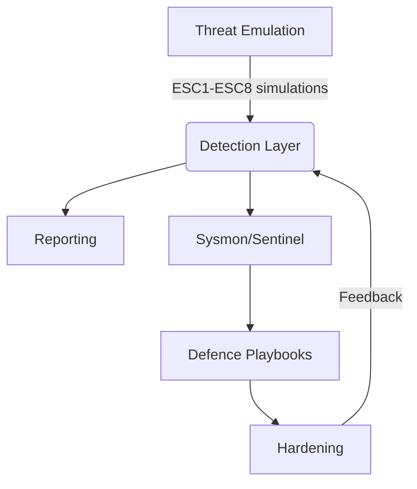

# Lab Architecture

## Components

- **Attacks**: Python playbooks mirror Certify/Certipy behavior for ESC1–ESC8.
- **Detection**: `pki_misconfig_scanner.py` and KQL queries surface risky
  templates, CA ACLs, and enrollment anomalies.
- **Defence**: PowerShell hardening scripts, Sysmon rules, and Sentinel workbook
  provide response and monitoring guidance.
- **Reporting**: CLI produces Markdown/JSON outputs suitable for executive or
  engineering consumption.

## Data Model
- **CertificateTemplate**: mirrors key ADCS template metadata (enrollment
  permissions, EKUs, publication, key size, subordinate CA allowance).
- **CertificateAuthority**: captures HTTP enrollment endpoints and ACLs to
  evaluate ESC5/ESC8 conditions.
- **ScanResult**: shared between detection and exploitation modules to keep
  findings consistent.

## Execution Flow
1. `adcs_scan.py detect` loads the mock inventory via `load_mock_environment`.
2. `scan_inventory` applies ESC predicates, creates a `ScanReport`, and writes
   Markdown/JSON through `save_report`.
3. `adcs_scan.py exploit --technique escX` selects relevant templates and runs
   the simulation helper for that ESC technique.
4. Defensive assets are referenced via the CLI and detailed in `defence/`.

## Quality & Observability
- Logging is enabled across CLI and detection modules to support demos and CI
  pipelines; verbosity is adjustable with `-v` flags.
- Unit tests (`tests/`) exercise predicate logic and report generation.
- Style configuration lives in `pyproject.toml` (ruff, black, pytest).
